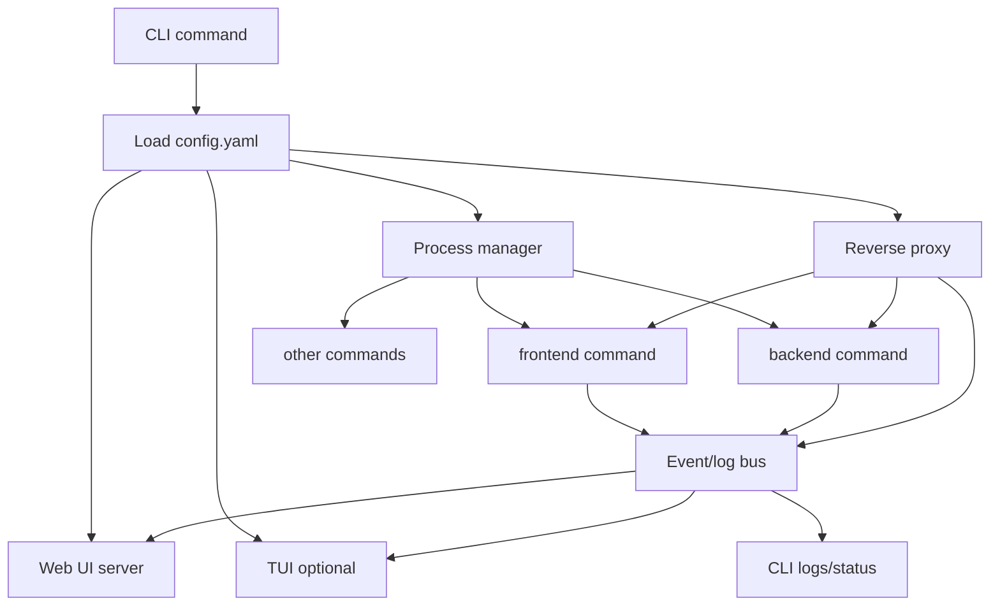

# DevProxy Project Details

## Summary

DevProxy is a developer-focused reverse proxy and process runner. It lets a project define one `config.yaml` that describes:

- which local commands should be started for development,
- which HTTP routes should be proxied to which services,
- where logs and runtime status should be viewed,
- how the same setup can run consistently across machines.

The goal is to make local development feel like this:

```sh
devproxy up
```

Instead of opening multiple terminals and manually running commands like:

```sh
pnpm dev
pnpm start:dev
```

DevProxy should be framework-agnostic. A target process can be Node.js, Go, Python, PHP, Java, Docker, or any command that can be started from the shell.

## Problem

Tools like nginx are powerful, but for local project development they can be annoying:

1. Every new device needs installation and setup.
2. Reverse proxy configuration has to be recreated or copied manually.
3. Each project usually needs multiple services started separately.
4. Frontend and backend logs are split across terminals.
5. Testing a full-stack app requires repetitive manual steps.
6. The setup is often tied to one developer's machine instead of living in the repo.

Example daily workflow today:

```sh
# terminal 1
pnpm dev

# terminal 2
pnpm start:dev

# terminal 3, optional
nginx or another proxy
```

DevProxy should replace that with a single reusable project command.

## Solution

DevProxy provides three core features:

1. **Reverse proxy**
   - Route requests from one local port to multiple upstream services.
   - Support path matching like `/api`, `/api/users`, `/app`, etc.
   - Support optional path rewriting.

2. **Process manager**
   - Start all configured development services.
   - Restart or stop services when needed.
   - Capture stdout/stderr logs from each service.
   - Show status, PID, exit code, uptime, and health.

3. **Developer interfaces**
   - Web UI for logs, service state, routes, and requests.
   - Optional TUI enabled by a flag like `-tui` or command like `devproxy up --tui`.
   - CLI commands for scripting and simple workflows.

## Core Goals

- **Config once, run everywhere**: project behavior lives in `config.yaml`.
- **Single command startup**: one command starts frontend, backend, proxy, and UI.
- **Framework agnostic**: any process command can be managed.
- **Portable**: usable on Linux, macOS, and Windows.
- **Small repo bootstrapper**: each repo can include a tiny runner that downloads the correct DevProxy binary if missing.
- **Observable by default**: logs and request events are available through CLI, TUI, and web UI.

## Non-Goals for the First Version

These are useful later, but should not block the MVP:

- Replacing production nginx/Traefik/Caddy setups.
- Distributed service orchestration.
- Kubernetes-style scheduling.
- Complex auth, teams, or hosted cloud dashboards.
- Full process sandboxing.

DevProxy should first solve local development pain well.

## Target Users

- Full-stack developers who repeatedly start frontend + backend services.
- Developers moving between devices who want project setup stored in the repo.
- Small teams that want a consistent local development command.
- Developers who prefer a TUI or web UI for multi-service logs.

## Example User Experience

### Install globally

```sh
devproxy up
```

### Run with a config path

```sh
devproxy up --config config.yaml
```

### Run with TUI

```sh
devproxy up --tui
```

### Run through repo bootstrapper

Linux/macOS:

```sh
./devproxy up
```

Windows:

```powershell
.\devproxy.exe up
```

If the real DevProxy binary is not available locally, the bootstrapper downloads the matching OS/architecture build, caches it, and runs it.

## Proposed Commands

```sh
devproxy up              # start configured processes, proxy, and UI
devproxy down            # stop processes started by devproxy
devproxy restart <name>  # restart one process
devproxy status          # show process and proxy status
devproxy logs [name]     # stream all logs or logs for one service
devproxy routes          # list configured proxy routes
devproxy validate        # validate config.yaml
devproxy version         # show version and build info
```

Common flags:

```sh
--config config.yaml     # config file path
--tui                    # open terminal UI
--ui                     # enable web UI, default true later
--no-ui                  # disable web UI
--verbose                # more logs
```

## Proposed Config Shape

The current repository already has basic proxy config. Long term, the config can grow into this shape:

```yaml
version: 1

server:
  proxy:
    host: 127.0.0.1
    port: 8082
  ui:
    host: 127.0.0.1
    port: 8081

processes:
  - name: frontend
    command: pnpm dev
    working_dir: ./frontend
    env:
      PORT: "3000"
    health:
      url: http://127.0.0.1:3000
      timeout: 30s

  - name: backend
    command: pnpm start:dev
    working_dir: ./backend
    env:
      PORT: "4000"
    health:
      url: http://127.0.0.1:4000/health
      timeout: 30s

proxy:
  targets:
    - name: frontend
      path: /
      url: http://127.0.0.1:3000
      rewrite: false

    - name: api
      path: /api
      url: http://127.0.0.1:4000
      rewrite: true
```

## Config Sections

### `server.proxy`

Defines where the reverse proxy listens.

```yaml
server:
  proxy:
    host: 127.0.0.1
    port: 8082
```

### `server.ui`

Defines where the web UI listens.

```yaml
server:
  ui:
    host: 127.0.0.1
    port: 8081
```

### `processes`

Defines commands DevProxy should manage.

Fields:

| Field | Purpose |
| --- | --- |
| `name` | Unique process name. |
| `command` | Shell command to run. |
| `working_dir` | Directory where the command runs. |
| `env` | Extra environment variables. |
| `health.url` | Optional URL used to check readiness. |
| `health.timeout` | Optional max wait time for readiness. |
| `restart` | Optional restart policy later. |

### `proxy.targets`

Defines reverse proxy routes.

Fields:

| Field | Purpose |
| --- | --- |
| `name` | Route/upstream name. |
| `path` | Incoming request path prefix. |
| `url` | Upstream service URL. |
| `rewrite` | Whether to remove the matched path prefix before forwarding. |

## Runtime Architecture



## Internal Components

Suggested packages:

| Package | Responsibility |
| --- | --- |
| `cmd/devproxy` | CLI entrypoint and flags. |
| `internal/config` | YAML parsing, defaults, validation. |
| `internal/proxy` | Reverse proxy route matching and forwarding. |
| `internal/process` | Start/stop/restart configured commands. |
| `internal/event` | Shared event bus for logs, requests, process status. |
| `internal/logger` | Request/process log formatting and publishing. |
| `internal/uiserver` | Web UI HTTP server and API/SSE/WebSocket endpoints. |
| `internal/tui` | Terminal UI. |
| `internal/bootstrap` | Bootstrapper support logic, if kept in Go. |

## Event Model

DevProxy needs one event stream that both the web UI and TUI can consume.

Event types:

- `process.started`
- `process.output`
- `process.exited`
- `process.restarted`
- `process.health_changed`
- `proxy.request`
- `proxy.error`
- `devproxy.ready`

Example process log event:

```json
{
  "type": "process.output",
  "timestamp": "2026-08-18T10:00:00Z",
  "process": "backend",
  "stream": "stdout",
  "message": "Server listening on port 4000"
}
```

Example proxy request event:

```json
{
  "type": "proxy.request",
  "timestamp": "2026-08-18T10:00:01Z",
  "method": "GET",
  "path": "/api/users",
  "route": "api",
  "upstream": "http://127.0.0.1:4000",
  "status": 200,
  "duration_ms": 12
}
```

## Web UI

The web UI should show:

- configured processes,
- running/stopped/failed state,
- per-process logs,
- all combined logs,
- proxy request logs,
- configured routes,
- restart/stop buttons later.

MVP can be a simple server-rendered HTML page with Server-Sent Events. A richer frontend can come later.

## TUI

The TUI should be optional and enabled explicitly:

```sh
devproxy up --tui
```

Suggested TUI layout:

- tabs for `all`, each process, and proxy requests,
- status bar with running services,
- log pane with color-coded stdout/stderr,
- shortcuts for restart/stop later.

Potential Go libraries:

- `github.com/charmbracelet/bubbletea`
- `github.com/charmbracelet/lipgloss`
- `github.com/rivo/tview`

## Bootstrapper Design

The bootstrapper is a small file committed into each project repo. Its job is not to implement DevProxy. Its job is only to ensure the real DevProxy binary exists and then execute it.

### Behavior

1. Detect OS and architecture.
2. Decide expected binary name and cache path.
3. Check if the DevProxy binary already exists.
4. If missing, download it from a release URL.
5. Verify checksum if available.
6. Mark executable on Linux/macOS.
7. Forward all CLI args to the downloaded binary.

### Example cache paths

Linux/macOS:

```text
.devproxy/bin/devproxy-linux-am64
.devproxy/bin/devproxy-darwin-arm64
```

Windows:

```text
.devproxy/bin/devproxy-windows-amd64.exe
```

### Release naming

Recommended release asset names:

```text
devproxy-linux-amd64
devproxy-linux-arm64
devproxy-darwin-amd64
devproxy-darwin-arm64
devproxy-windows-amd64.exe
devproxy-windows-arm64.exe
checksums.txt
```

### Bootstrapper options

There are two practical options:

1. **Script bootstrapper**
   - `devproxy` shell script for Linux/macOS.
   - `devproxy.ps1` or `devproxy.cmd` for Windows.
   - Easier to inspect and commit.

2. **Tiny compiled bootstrapper**
   - One small binary per OS.
   - More consistent behavior.
   - Still needs distribution.

For early development, script bootstrappers are simpler.

## MVP Roadmap

### Phase 1: Stable proxy foundation

- Fix current build errors.
- Load config reliably.
- Validate proxy target routes.
- Start proxy server.
- Log request events.
- Keep existing route matching tests passing.

### Phase 2: Process manager

- Add `processes` config section.
- Start configured commands.
- Capture stdout/stderr.
- Stop processes on shutdown.
- Publish process events.
- Add tests for process lifecycle where practical.

### Phase 3: Web UI MVP

- Add basic web page.
- Stream logs/events via SSE.
- Show process status and proxy request logs.

### Phase 4: CLI polish

- Replace raw flags with subcommands if needed.
- Add `up`, `validate`, `status`, and `logs`.
- Add better terminal output.

### Phase 5: TUI

- Add `--tui` mode.
- Show process tabs and log streams.
- Support quit and maybe restart shortcuts.

### Phase 6: Bootstrapper

- Add release build workflow.
- Add checksums.
- Add Linux/macOS bootstrap script.
- Add Windows bootstrap script.
- Document how to commit bootstrapper into any repo.

## Current Repository Status

Already started:

- Go module: `github.com/phy0hk/devproxy`
- Basic YAML config: `config.yaml`
- Reverse proxy package: `internal/proxy`
- Event bus package: `internal/event`
- Request logging package: `internal/logger`
- UI/event streaming package: `internal/uiserver`
- Tests for route matching and event bus

Known current build issues to fix next:

- `cmd/devproxy/main.go` imports `internal/server`, but the existing package path appears to be `internal/uiserver` with package name `server`.
- `internal/config/config.go` defaults/validates `c.Server.Host` and `c.Server.Port`, but `ServerConfig` now contains nested `Proxy` and `UI` addresses.
- `internal/logger/logger.go` formats `DurationMS` with `%s` even though it is an `int64`.

## Recommended Immediate Next Step

Before adding process management, make the existing proxy build and run cleanly:

1. Fix config defaults for `server.proxy` and `server.ui`.
2. Fix package naming/import mismatch around the main server.
3. Fix logger formatting.
4. Run `go test ./...`.
5. Then add `processes` to config and implement the process manager.
